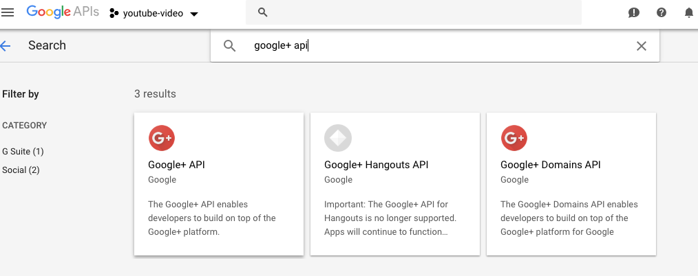
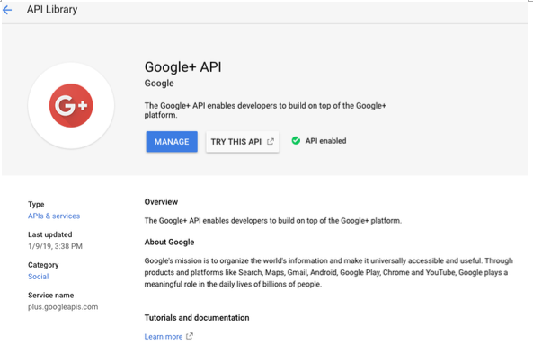
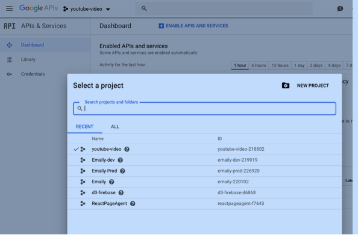
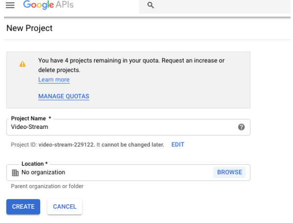
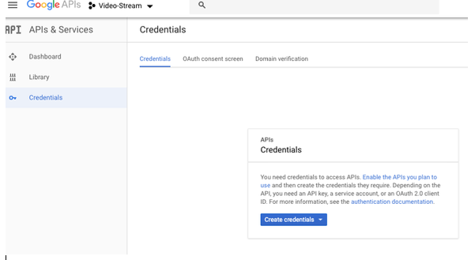
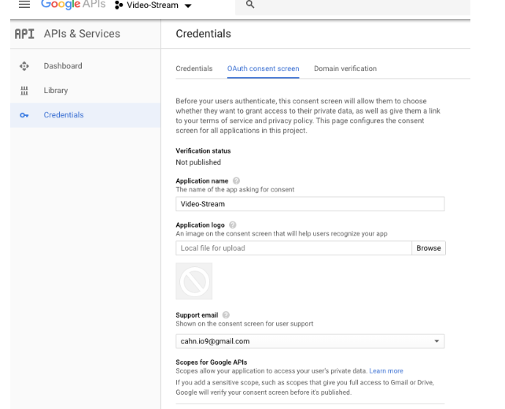
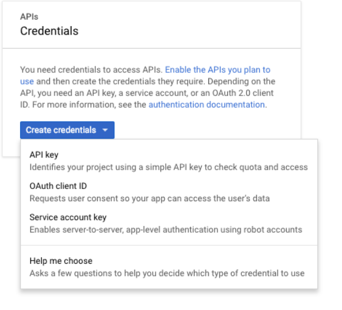
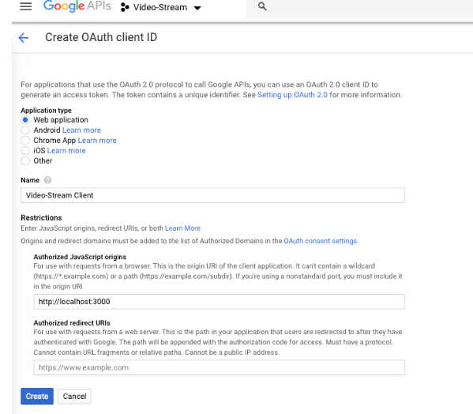
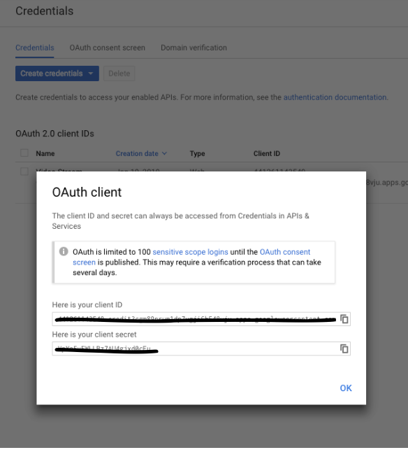
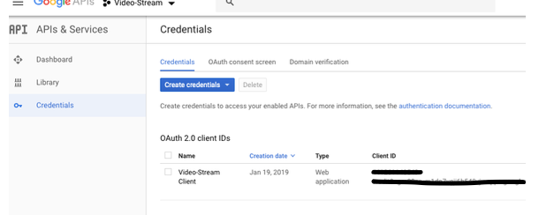

## Google OAuth20 Client side 

####  This page it to help make Google OAuth20 implementation in React Client side:

#### This page is mostly to explain how to setup OAuth20 in Google+ API environment. 


Reference: https://developers.google.com/api-client-library/javascript/samples/samples#authorizing-and-making-authorized-requests


__Step 1__: Google console is changed frequently.  You may find a different way or different screens.

First, login to the following with your Google Account: 
__https://console.developers.google.com__


And find Google+ API,  OAuth20 is located in Google+ API. If you search OAuth20, nothing is shown.


__Step 2__: You can see Google+ API. Click on Manage button. You can find the following screen.  



__Step 3__: 
On the following screen, click on project button (my screen shows “youtube-video” next to Google APIs logo.  
If you don’t have any new project, create a new one here.   
Click on “NEW PROJECT” button to create a new one. 


__Step 4__: 
After clicking on “NEW PROJECT”, you can choose a name for a new project.   
I have named my new project “Video-Stream”.


__Step 5__:
It may take a few seconds to minutes to create a new project by Google.   
Click on “Google APIs” button on the top left corner and make sure the new project created is chosen in case you have multiple projects   
On the following screen, “Video-Stream” is the project just created.    
At this point, even though you click on “Credential” from the menu on the left, you cannot create credential at this point yet.
You need to choose “OAuth consent screen” first here which is the next to credentials.    
You need come back to this screen after finishing up "OAuth Consent screen".  


__Step 6__: 
All you need to enter is “Application name”.   I entered “Video-Stream” again here.   
Then, click on “save” at the bottom of the screen (“save” button isn’t shown on the following, sorry). 


__Step 7__: 
As mentioned in Step 5,  you come back to "Credentials". Click on “Credentials” and Click on "Create Credentials” button and Choose “OAuth client ID”.   


__Step 8__:
We need to choose type of application here.  Choose “Web application” and enter Name (“Video-Stream Client” is what I entered here).   
It is important to set Restrictions.   
Since this is for development, enter http://localhost:3000 for React dev server.   
Click on “Create” button.  When you deploy your product, you need to change it from "http://localhost:3000" to your own "https://yoururl.whatever".


__Step 9__:
Finally, we have finished up the setting.   OAuth client is finally set up.   What we need is “client ID” only as we just want client side authentication.   
Copy “Client ID” and save it for now.  We need it for OAuth lib code.  "client secret" is additionally needed for server side authentication.


__Step 10__:
The following is the final screen you should see.  
You can always revisit to get client ID and edit the info.   



## OAuth20 Lib code,
#### [IMPORTANT] Note that you must add the following script to index.html to access "gapi".


```javascript 
/public/index.html, 

Add the following,
  
<script src="https://apis.google.com/js/api.js"></script>

Then, it should look like below. 

<!DOCTYPE html>
<html lang="en">
  <head>
    <meta charset="utf-8" />
    <link rel="shortcut icon" href="%PUBLIC_URL%/favicon.ico" />
    <meta
      name="viewport"
      content="width=device-width, initial-scale=1, shrink-to-fit=no"
    />
    <meta name="theme-color" content="#000000" />

    <script src="https://apis.google.com/js/api.js"></script>

    <link rel="manifest" href="%PUBLIC_URL%/manifest.json" />

    <title>React App</title>
  </head>
  <body>
    <div id="root"></div>
  </body>
</html>

```

The following link is the best resource to show how to create OAuth20 lib in Javascript.

https://developers.google.com/api-client-library/javascript/samples/samples#authorizing-and-making-authorized-requests

Basically, we can access gapi (Google API) in global scope.   

For example, you can use the following on console to login/logout after initializing OAuth20.

gapi.auth2.getAuthInstance().signIn();
gapi.auth2.getAuthInstance().signOut();


You can find more detail in GoogleOAuth20.js file.  

